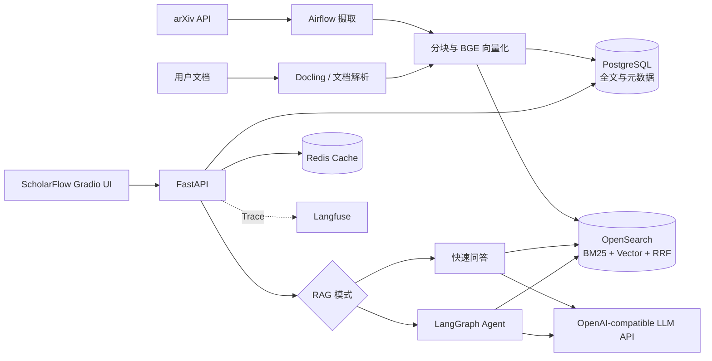
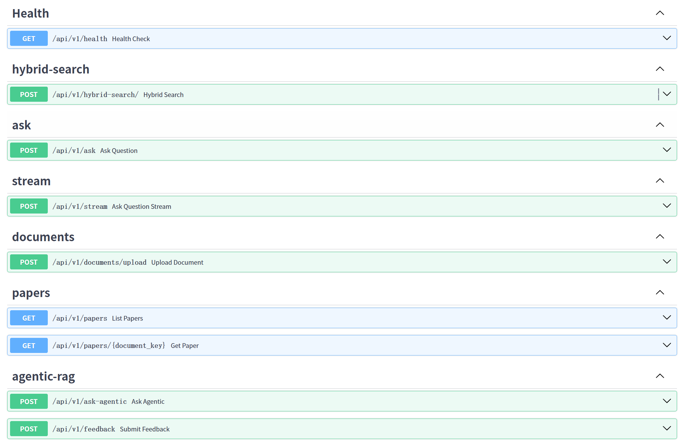
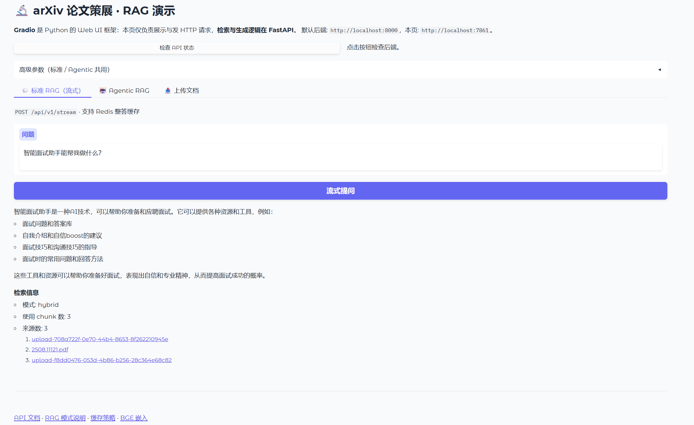
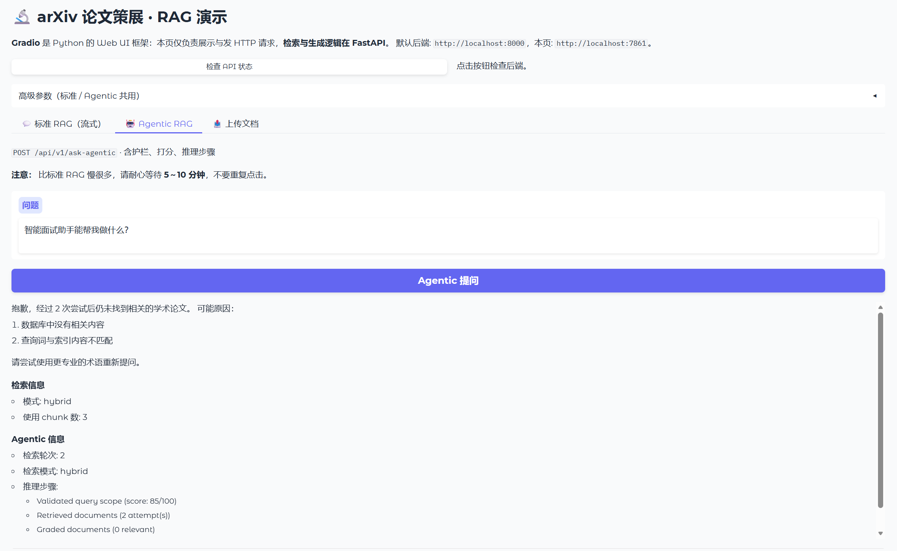

<div align="center">

# ScholarFlow

### 面向学术论文与私有文档的生产级 Agentic RAG 工作台

混合检索、会话记忆、多步 Agent 与可观测性集成在一个完整的研究工作流中。

[](https://www.python.org/)
[](https://fastapi.tiangolo.com/)
[](https://www.gradio.app/)
[](https://opensearch.org/)
[](https://www.langchain.com/langgraph)
[](LICENSE)

</div>

---

## 项目简介

ScholarFlow 是一个端到端 RAG 项目，覆盖文档摄取、解析分块、向量化、混合检索、生成、记忆、评估与可观测性。它既能检索 arXiv 论文，也支持将 PDF、Word、Markdown、文本和 Excel 文件加入私有知识库。

项目提供两种问答路径：

- **快速问答**：单轮检索并流式生成，适合日常搜索与连续追问。
- **深度研究**：由 LangGraph 编排护栏检查、检索、相关性评分、问题改写和二次检索。

生成模型通过 **OpenAI-compatible Chat Completions API** 接入，当前可配置 Qwen 等在线模型，**不依赖 Ollama**。

## 核心能力

| 能力 | 实现 |
|---|---|
| 混合检索 | OpenSearch BM25 + BGE 512 维向量 + RRF 融合 |
| Agentic RAG | LangGraph 多节点工作流，支持护栏、打分和查询改写 |
| 文档摄取 | arXiv 定时摄取，以及 PDF / DOCX / Markdown / TXT / Excel 上传 |
| 会话记忆 | Redis 短期记忆 + PostgreSQL 跨会话长期记忆 |
| 流式回答 | FastAPI SSE 接口与 Gradio 实时输出 |
| 来源追踪 | 回答附带来源、检索模式与使用的 chunk 数 |
| 模型接入 | OpenAI-compatible API，可配置主模型和降级模型 |
| 质量评估 | Ragas Faithfulness、Context Precision、Recall 等指标 |
| 可观测性 | Langfuse trace、评分与运行监控 |
| 私有部署 | 本地 BGE embedding，Docker 基础设施，数据不进入公共向量库 |

## 系统架构



<details>
<summary>查看项目演进架构图</summary>


</details>

## 界面与 API

新版 ScholarFlow 界面包含快速问答、深度研究、知识库上传和统一的检索参数面板。

| Swagger API | 标准 RAG | Agentic RAG |
|---|---|---|
|  |  |  |

## 技术栈

| 层级 | 技术 |
|---|---|
| Web UI | Gradio |
| API | FastAPI、Pydantic、SSE |
| Agent | LangGraph、LangChain |
| LLM | OpenAI-compatible Chat Completions API |
| Embedding | BGE Small ZH v1.5（本地 CPU 推理） |
| 检索 | OpenSearch 2.x，BM25、kNN、RRF |
| 数据与缓存 | PostgreSQL、Redis |
| 文档解析 | Docling、python-docx、pandas、openpyxl |
| 调度 | Apache Airflow |
| 评估与追踪 | Ragas、Langfuse |
| 工程化 | Docker Compose、uv、pytest、ruff、mypy |

## 快速开始

### 1. 准备环境

- Python 3.12
- [uv](https://docs.astral.sh/uv/) 或已配置依赖的 Python 环境
- Docker / OrbStack
- 已有的 OpenSearch、PostgreSQL 与 Redis 容器

复制环境变量模板并填写在线模型配置：

```bash
cp .env.example .env
```

```dotenv
LLM_PROVIDER=openai
OPENAI_API_KEY=your-api-key
OPENAI_BASE_URL=https://your-provider.example/v1
OPENAI_MODEL=your-model-name
OPENAI_MODEL_FALLBACK=your-fallback-model
```

> `.env` 已被 Git 忽略。不要把真实 API Key 提交到仓库。

安装依赖并准备本地 embedding 模型：

```bash
uv sync
uv run python scripts/download_bge_model.py
```

### 2. 启动已有数据服务

当前本地环境使用以下端口：OpenSearch `9200`、PostgreSQL `5432`、Redis `6380`。

```bash
docker start opensearch postgres redis
```

如果机器上没有 OpenSearch，可选择启动仓库提供的实例：

```bash
docker compose --profile bundled-search up -d opensearch opensearch-dashboards
```

### 3. 启动 API 与界面

在两个终端中分别执行：

```bash
# Terminal 1
python -m src.main

# Terminal 2
python gradio_launcher.py
```

使用 `uv` 时可改为 `uv run python ...`。

| 服务 | 地址 |
|---|---|
| ScholarFlow UI | <http://localhost:7861> |
| Swagger API | <http://localhost:8000/docs> |
| API Health | <http://localhost:8000/api/v1/health> |
| OpenSearch | <http://localhost:9200> |

## 主要 API

| 方法 | 路径 | 说明 |
|---|---|---|
| `GET` | `/api/v1/health` | 聚合服务健康状态 |
| `POST` | `/api/v1/stream` | 标准 RAG 流式问答 |
| `POST` | `/api/v1/ask-agentic` | Agentic RAG 多步问答 |
| `POST` | `/api/v1/hybrid-search` | BM25 + 向量混合检索 |
| `POST` | `/api/v1/documents/upload` | 上传并索引私有文档 |
| `GET` | `/api/v1/papers` | 查询文档列表 |
| `GET` | `/api/v1/papers/{id}` | 获取文档全文与元数据 |

## 项目结构

```text
├── src/
│   ├── routers/              # FastAPI 路由
│   ├── services/
│   │   ├── agents/           # LangGraph Agent 与节点
│   │   ├── document_upload/  # 私有文档摄取
│   │   ├── embeddings/       # 本地 BGE embedding
│   │   ├── indexing/         # 分块与混合索引
│   │   ├── memory/           # 会话记忆
│   │   └── opensearch/       # 查询与索引客户端
│   ├── gradio_app.py         # ScholarFlow Web UI
│   └── main.py               # FastAPI 入口
├── airflow/dags/             # arXiv 摄取 DAG
├── scripts/                  # 模型下载、重建索引、离线评估
├── tests/                    # 单元、API 与集成测试
├── docs/                     # 设计与运行说明
└── compose.yml               # 可选容器编排
```

## 测试与评估

```bash
# 测试
pytest

# 静态检查
ruff check .

# Ragas 离线评估
python scripts/eval_rag.py
```

评估结果会写入 `scripts/eval_results/`。更多说明见 [docs/eval.md](docs/eval.md)。

## 深入阅读

- [标准、流式与 Agentic RAG 模式](docs/RAG-modes.md)
- [Redis 缓存策略](docs/cache.md)
- [BGE embedding 与重建索引](docs/embeddings.md)
- [Airflow 摄取流程](docs/Airflow.md)
- [Ragas 评估方案](docs/eval.md)

## 致谢

本项目在 [jamwithai/production-agentic-rag-course](https://github.com/jamwithai/production-agentic-rag-course) 的课程项目基础上扩展，新增了私有文档上传、本地中文 embedding、全文 API、会话记忆、Agentic 降级策略、离线评估和完整展示界面。

## License

[MIT License](LICENSE)
